# RAG 系统指南

检索增强生成（RAG）系统的完整使用指南。

---

## 📖 指南列表

### 概述和基础
- [RAG 概述](./overview.md) - RAG 系统介绍和完整指南
- 文档加载器 - 多格式文档加载（即将添加）
- 文本分割器 - 智能文本分割（即将添加）
- 嵌入模型 - Embedding 集成（即将添加）
- 向量存储概述 - 向量数据库选择（即将添加）

### 向量存储
- [Milvus](./milvus.md) - Milvus 向量数据库使用
- [Milvus Hybrid Search](./milvus-hybrid.md) - 混合搜索（向量+关键词）
- Chroma - Chroma 开源向量数据库（即将添加）
- Pinecone - Pinecone 云端向量服务（即将添加）

### 高级检索
- [MMR 搜索](./mmr.md) - 最大边际相关性搜索
- [LLM Reranking](./reranking.md) - 基于 LLM 的智能重排序

### 文档加载器
- [PDF 加载器](./pdf-loader.md) - PDF 文档处理
- Word/DOCX 加载器 - Word 文档处理（即将添加）
- HTML/Web 加载器 - 网页抓取和处理（即将添加）
- Excel 加载器 - Excel 表格处理（即将添加）

---

## 🎯 RAG 工作流

```mermaid
graph LR
    A[文档] --> B[加载器]
    B --> C[分割器]
    C --> D[Embedding]
    D --> E[向量存储]
    E --> F[检索]
    F --> G[重排序]
    G --> H[生成答案]
```



### 1. 文档加载
支持多种格式：
- Text, Markdown, JSON, CSV
- PDF（学术论文、报告）
- Word/DOCX（商业文档）
- HTML（网页内容）
- Excel（数据表格）

### 2. 文本分割
智能分割策略：
- Character Splitter - 按字符分割
- Recursive Splitter - 递归分割
- Token Splitter - 按 Token 分割
- Markdown Splitter - 保持 Markdown 结构

### 3. 向量化
生成文本嵌入：
- OpenAI Embeddings（ada-002, text-embedding-3-small/large）
- 更多模型支持中...

### 4. 向量存储
选择合适的向量数据库：

| 数据库 | 特点 | 适用场景 |
|--------|------|---------|
| InMemory | 内存存储 | 开发测试 |
| Milvus | 企业级，Hybrid Search | 生产环境 |
| Chroma | 开源，轻量级 | 本地/轻量级生产 |
| Pinecone | 云托管 | 大规模生产 |

### 5. 高级检索
提升检索质量：
- **Hybrid Search** - 向量+关键词混合搜索
- **MMR** - 平衡相关性和多样性
- **Reranking** - LLM 智能重排序

---

## 🚀 完整示例

```go
// 1. 加载文档
pdfLoader := loaders.NewPDFLoader(loaders.PDFLoaderOptions{
    Path: "document.pdf",
})
docs, _ := pdfLoader.Load(ctx)

// 2. 分割文本
splitter := splitters.NewRecursiveCharacterTextSplitter(
    splitters.RecursiveCharacterTextSplitterOptions{
        ChunkSize:    1000,
        ChunkOverlap: 200,
    },
)
chunks := splitter.SplitDocuments(docs)

// 3. 创建向量存储
emb := embeddings.NewOpenAIEmbeddings(embeddings.OpenAIEmbeddingsConfig{
    APIKey: "sk-...",
})
store, _ := vectorstores.NewMilvusVectorStore(config, emb)

// 4. 添加文档
store.AddDocuments(ctx, chunks)

// 5. 混合搜索
results, _ := store.HybridSearch(ctx, "查询", 5, &vectorstores.HybridSearchOptions{
    VectorWeight:   0.7,
    KeywordWeight:  0.3,
    RerankStrategy: "rrf",
})

// 6. MMR 搜索（提升多样性）
mmrResults, _ := mmr.MMRSearch(ctx, store, "查询", 10, mmr.Config{
    Lambda: 0.5,  // 平衡相关性和多样性
    FetchK: 20,
})

// 7. LLM 重排序（进一步提升精度）
reranker := reranker.NewLLMReranker(llm, reranker.DefaultPromptTemplate)
finalResults, _ := reranker.Rerank(ctx, "查询", mmrResults, 5)

// 8. 生成答案
prompt := fmt.Sprintf("基于以下文档回答问题：\n\n%s\n\n问题：%s", 
    formatDocs(finalResults), "查询")
answer, _ := llm.Invoke(ctx, []types.Message{
    types.NewUserMessage(prompt),
})
```

---

## 📊 选择向量存储

### 快速对比

| 特性 | InMemory | Milvus | Chroma | Pinecone |
|------|----------|--------|--------|----------|
| 持久化 | ❌ | ✅ | ✅ | ✅ |
| Hybrid Search | ❌ | ✅ | ❌ | ❌ |
| 云托管 | ❌ | 可选 | 可选 | ✅ |
| 价格 | 免费 | 免费 | 免费 | 付费 |
| 规模 | 小 | 大 | 中 | 大 |

### 选择建议

- **开发测试** → InMemory 或 Chroma
- **轻量级应用** → Chroma
- **企业应用** → Milvus
- **云端部署** → Pinecone 或 Milvus Cloud

---

## 💡 最佳实践

### 1. 文档分割
- 根据文档类型选择分割器
- 设置合适的 ChunkSize（500-1500）
- 使用 ChunkOverlap 保持上下文连贯性

### 2. 检索优化
- 使用 Hybrid Search 提升准确率
- 使用 MMR 增加结果多样性
- 使用 LLM Reranking 进一步优化

### 3. 性能优化
- 使用 CachedEmbeddings 减少 API 调用
- 批量添加文档
- 设置合理的检索数量（k=5-20）

---

## 📚 相关资源

- [快速开始](../../getting-started/) - 新手入门
- [核心功能指南](../core/) - 核心组件
- [示例代码](../../examples/) - RAG 示例

---

<div align="center">

**[⬆ 回到指南首页](../README.md)** | **[回到文档首页](../../README.md)**

</div>
